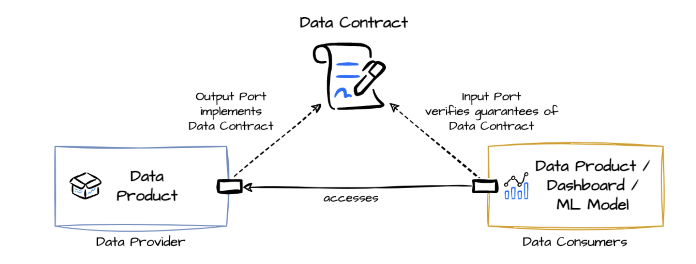

# generate-fake-data
Generate fake data sets using the `faker` library.

# Background

I work on a data project, utilising dbt and bigquery, with pipelines in gitlab. We ingest finance data from core systems, transform that with dbt (data vault methodology) and serve it in a curate layer in bigquery. We need to test our data vault models with appropriate data, since we don't have access to Prod data.

# Requirements

1. Use a csv driven process, where the csv defines the ingestion file metadata with attribute names and data types
   
2. generate fake data that can simulate real-world scenarios; i.e. if an attribute is `name` with type `string`, try and generate a realistic name
   
3. allow the ability for different options and scenarios. pass in those runtime parameters using something like the `typer` library
   
4. output a csv file, that conforms to the ingestion metadata, that can be stored in GCS

## Installation
Install using poetry.  This makes the `generate-fake-data` cli utility
```
poetry install
poetry shell
```

```
generate-fake-data
```


# Fake Data Generation
Fake data sets are generated using the following sequence:
* parse schema definitions, including PK/FK rels/constraints
* create duckDB table objects
* get the record cardinality information
* populate record PK and attribute values - skip FK values
* update PK/FK relationships
* export to csv
* use a `.fake_data_cache/` to hold duckDB objects

# Data Contracts

https://datacontract.com/
---
https://github.com/datacontract/datacontract-specification



### Utilizing DataContract.com for Enhanced Fake Data Generation

In our quest to ensure robust and accurate testing of our data vault models, we've identified DataContract.com as a pivotal resource. This platform amplifies our ability to generate high-quality, realistic fake data sets tailored to our specific requirements. Here's why DataContract.com is integral to our project:

### Schema Definitions and Data Integrity

Our project necessitates the parsing of intricate schema definitions, including the management of primary and foreign key relationships. DataContract.com aids in the meticulous definition and management of these data contracts, ensuring our fake data adheres to the exact specifications of our data models. This alignment is crucial for maintaining data integrity throughout our testing processes.

### Realistic Data Simulation

To test the resilience and accuracy of our data transformations effectively, the fake data must mirror real-world scenarios as closely as possible. DataContract.com supports this need by enabling the specification of data characteristics and patterns, such as generating authentic-looking names for a name attribute, ensuring our data sets are both realistic and varied.

### Customizable Data Generation

Our testing scenarios demand flexibility in data generation, allowing for the simulation of various data conditions. DataContract.com's customizable data generation capabilities permit the definition of bespoke rules or templates, catering to our unique requirements and enhancing the depth of our testing.

### Seamless Ecosystem Integration

Our workflow integrates tightly with dbt, BigQuery, and GitLab. DataContract.com's potential for integration into this ecosystem—whether through APIs or direct tooling—means we can automate the generation and deployment of fake data sets, streamlining our continuous integration and delivery pipelines.

### Compliance and Data Privacy

Working with finance data brings its set of compliance and privacy obligations. By generating fake data in line with predefined contracts, we sidestep the risks associated with using sensitive or real customer data, ensuring our testing practices are both safe and compliant with regulations like GDPR and CCPA.

Incorporating DataContract.com into our data project strategy not only enhances the quality and realism of our fake data but also aligns with our commitment to data integrity, privacy, and efficient testing methodologies. This approach significantly bolsters our confidence in the data transformations and analytics we develop, ensuring they are tested thoroughly and reliably before deployment.

> TODO: include the ability to run `datacontract test datacontracts/customer.yaml`